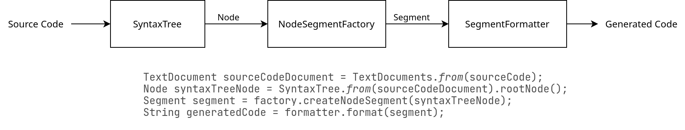
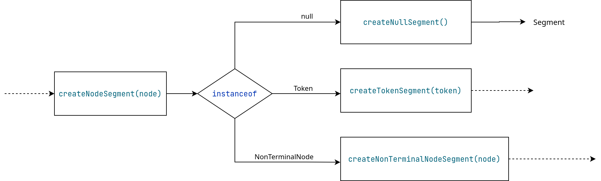
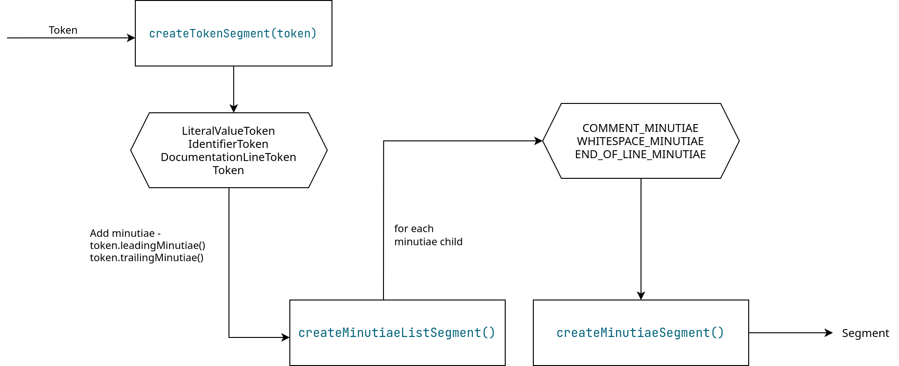
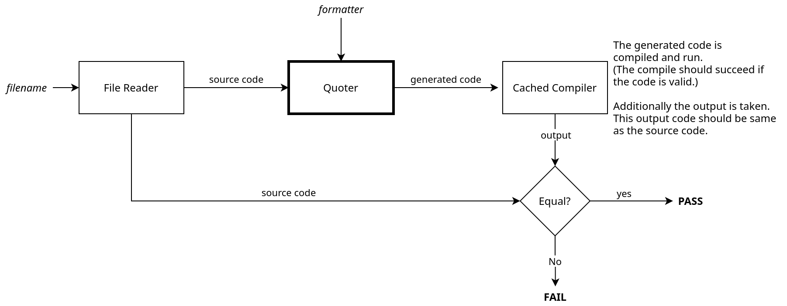

# Quoter Tool

> This document explains the implementation of the tool in detail.

## Implementation

### Overview

Following is the base implementation of the tool. 

- The tool will input the source ballerina code and parse it into a Syntax Tree using the `SyntaxTree` API. 
- Using the root node it provides, the tool would then attempt to transform the tree of Node into a tree of Segments. These segments will represent every API call required to generate the Java code.
- Using the root segment, the formatter would insert the required formatting (adding whitespaces, rearranging code segments) and finally output the generated code.



### Node to Segment Tree Conversion

#### Segments

Segments are nodes that make up the Syntax API calls. 

- `NodeFactorySegment` - Node factory API call generation segment. These segments are the sections of the generated code that follows the format `NodeFactory.<Type>createNodeType(param1, param2)`. These segments denote the non-terminal nodes of the segment tree. Parameters are the child segment nodes.
- `CodeSegment` - Segment which encompasses a code segment. These can be any random code segments, number literals, etc... For example, `null` is a code segment. These are terminal nodes in the segment tree.
- `StringSegment` - Special code segment which denotes a string literal. Because this is a string literal, these would escape the special characters when converted to a string. `"Hello"` is a string segment.  These are terminal nodes in the segment tree.
- `SyntaxKindSegment` - Segment which denotes a `SyntaxKind`. These will follow the format `SyntaxKind.ABC_KIND`.

#### Segment Factories

Recursively transforms the `Node` tree into a `Segment` tree. 

##### NodeSegmentFactory

The public interface to start transforming starting from the root node.



##### TokenSegmentFactory

Transforms `Token` into `NodeFactorySegment`. Adds minutiae nodes as well.



##### NonTerminalSegmentFactory

Transforms `NonTerminalNode` into `NodeFactorySegment`. This uses reflection to find the correct method call and to match parameter names.


#### Use of reflection

Factory calls for `NonTerminalSegmentFactory` calls are found using reflection. If the node type is `FunctionDefinitionNode` then the factory call is `createFactoryDefinitionNode`. Then the child node names are matched with the `child-nodes.json` to find the missing nodes. These missing nodes will be `CodeSegment(null)` and the other node segments will be added as parameters.

### Output Formatting

After the segment tree has been constructed, the tree will be formatted. Here a few main strategies are implemented.

#### NoFormatter

Directly convert the segment tree into a string of method calls without any whitespaces.

```java
NodeFactory.createModulePartNode(NodeFactory.createNodeList(),NodeFactory.createNodeList(),NodeFactory.createToken(SyntaxKind.EOF_TOKEN,NodeFactory.createEmptyMinutiaeList(),NodeFactory.createEmptyMinutiaeList()))
```

#### Default Formatter

Formats the output of the segment tree string by adding whitespaces. No reorganization of the tree is done. The formatting is done to bring the output similar to the output of the [dart formatter](https://dart.dev/tools/dartfmt).

```java
NodeFactory.createModulePartNode(
	NodeFactory.createNodeList(),
	NodeFactory.createNodeList(),
	NodeFactory.createToken(
		SyntaxKind.EOF_TOKEN,
		NodeFactory.createEmptyMinutiaeList(),
		NodeFactory.createEmptyMinutiaeList()
	)
)
```

#### VariableFormatter

Reorganizes and formats the code so that each Node is defined in a new line and group the token creation variable definitions. Traverses the Segment tree again to format. The final output will always be assigned to a variable named `modulePartNode`.

```java
MinutiaeList trailingMinutiae, leadingMinutiae;

NodeList<ImportDeclarationNode> nodeList = NodeFactory.createNodeList();

NodeList<ModuleMemberDeclarationNode> nodeList1 = NodeFactory.createNodeList();

leadingMinutiae = NodeFactory.createEmptyMinutiaeList();
trailingMinutiae = NodeFactory.createEmptyMinutiaeList();
Token token = NodeFactory.createToken(SyntaxKind.EOF_TOKEN,leadingMinutiae,trailingMinutiae);

ModulePartNode modulePartNode = NodeFactory.createModulePartNode(nodeList,nodeList1,token);
```

#### TemplateFormatter

Embeds the output to a template text. Here `%s` will be replaced from the generated code. This uses an `internalFormatter`(one of the above three formatters) to format the code which will be placed in the template. Following is `TemplateFormatter` with `DefaultFormatter` as the internal formatter.

```java
import io.ballerina.compiler.syntax.tree.*;

class QuoterTest {
    public static void main(String[] args) {
        Node node = NodeFactory.createModulePartNode(
			NodeFactory.createNodeList(),
			NodeFactory.createNodeList(),
			NodeFactory.createToken(
				SyntaxKind.EOF_TOKEN,
				NodeFactory.createEmptyMinutiaeList(),
				NodeFactory.createEmptyMinutiaeList()
			)
		);

        System.out.println(node.toSourceCode());
    }
}
```

### Configuration Management

To change how the internal settings work, the `QuoterConfig` class can be used. By extending this class, functions such as reading input, writing output can be changed. This is used by the command line application, web application, and the tests to change the behavior of the formatters, factories, etc...

## Applications

### Command Line Application

Entry point is on `QuoterCommandLine` class. This would create `QuoterCmdConfig` and pass it to the generating functions to get the necessary outputs. This uses Apache commons CLI tools to parse user inputs.

Run this application via,

```bash
$ ./gradlew quoter
```

### Web Application

Entry point is on `QuoterSpringBoot` class. This creates a `QuoterSpringConfig` and pass it to the generating functions. This `QuoterSpringConfig` class overrides the file writing/reading functionalities to read/write to a variable. Web application uses Java Spring Boot framework. Run this application by building the project and then running the generated `.war` file.

```bash
$ ./gradlew build
$ cd build/libs
$ java -jar quoter-0.0.1-SNAPSHOT.war
```

This would run the server in port 8080.

## Testing

The tests in this project are done in following manner.

