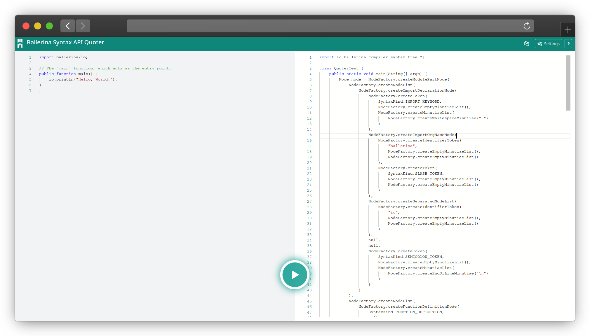

# The Quoter Web tool

> Server with a React Frontend for the quoter tool.
>
> The Online version of the web tool can be found in [http://46.101.157.247/](http://46.101.157.247/).



## Basic Usage

Enter the ballerina source code on the left-hand side pane and press the button to generate the respective Java Syntax 
API calls. The code can be copied to the clipboard using the copy button. Formatter can be changed via the settings button.

To build and run the web project, run the gradle task `bootRun`.
Or you may build the `war` file and then run the application.

```bash
$ gradle quoter-server:build
$ build/libs
$ java -jar quoter-server-1.0-SNAPSHOT.war
```

Default properties can be changed via changing the [`quoter.properties`](src/main/resources/quoter.properties) file. 
Note that the argument values will override these settings even if provided. All the paths in this file will be 
relative to this directory.

```properties
#Web settings
internal.web.default.template=template.txt
internal.web.variable.template=template-variable.txt

#Default Formatter name to use
external.formatter.name=default
#Whether to use a template
external.formatter.use.template=false
#Template path
external.formatter.template=template.txt
#Tab position in template mode
external.formatter.tab.start=2
```
